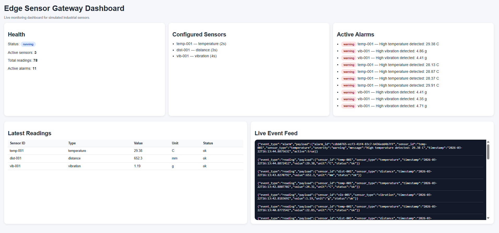
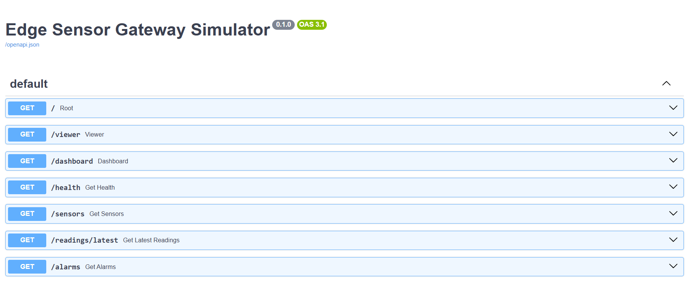

# 🚀 Edge Sensor Gateway Simulator

[](https://www.python.org/)
[](https://opensource.org/licenses/MIT)
[](https://github.com/AngeloMiletic16/edge-sensor-gateway/actions)
[](https://fastapi.tiangolo.com/)

A professional, high-performance industrial edge gateway simulator built with Python. This project simulates asynchronous sensor data collection, real-time alarm detection, and multi-protocol communication (REST, WebSocket, and MQTT).

---

## 📋 Overview

This project simulates a modular industrial edge gateway responsible for collecting telemetry from multiple simulated sensors such as Temperature, Distance, and Vibration sensors. The system continuously gathers readings, processes them asynchronously, evaluates alarm conditions based on configurable thresholds, and exposes the resulting data to external consumers through REST, WebSocket, and MQTT interfaces.

The project is inspired by real-world industrial and Industry 4.0 scenarios, where software components often sit between sensors, devices, and higher-level applications. In such environments, gateway services must be able to handle concurrent data streams, detect abnormal states, provide real-time visibility, and integrate with multiple communication protocols in a reliable and maintainable way.

The application was intentionally designed as more than a simple demo API. It aims to reflect the structure and responsibilities of a small edge-oriented Python system by combining:
- asynchronous sensor polling with `asyncio`
- event broadcasting over WebSocket
- telemetry publishing over MQTT
- REST endpoints for system visibility
- modular package organization
- configuration-driven behavior through YAML
- automated quality checks, testing, and CI workflows

From a software engineering perspective, the project demonstrates how Python can be used to build a cleanly structured, extensible, and testable service that resembles the kind of logic commonly found in industrial automation, telemetry pipelines, and embedded-adjacent backend systems.

**Key design goals:**
- demonstrate practical use of **Python Asyncio** for concurrent sensor processing
- implement common industrial communication interfaces such as **MQTT**, **HTTP**, and **WebSocket**
- showcase a modular and maintainable architecture with separated responsibilities
- provide a realistic portfolio example of an edge / industrial Python application
- ensure reliability through **automated testing**, **linting**, **type checking**, and **CI/CD workflows**

---

##  Screenshots

### Live Monitoring Dashboard


### API Documentation (Swagger UI)


---

##  Features

*   **Multi-Sensor Simulation**: Simulates temperature, distance, and vibration sensors with configurable polling intervals and noise.
*   **Async Data Collection**: Uses `asyncio` to run multiple sensor loops concurrently without blocking.
*   **Real-time Alarm Engine**: Evaluates readings instantly and generates alarm events when thresholds are exceeded.
*   **Triple-Stream Communication**:
    *   **REST API**: FastAPI endpoints for system state, health, and history.
    *   **WebSocket Stream**: Live broadcast of sensor readings and alarms to connected clients.
    *   **MQTT Publishing**: Integration with industrial brokers for telemetry and gateway health.
*   **YAML Configuration**: Flexible sensor and MQTT settings management via configuration files.
*   **Quality Driven**: Built with strict type checking (MyPy), linting (Ruff), and unit testing (Pytest).

---

##  Tech Stack

| Category | Technology |
| :--- | :--- |
| **Language** | Python 3.11+ |
| **Framework** | FastAPI (ASGI) |
| **Concurrency** | Asyncio |
| **Data Handling** | Pydantic, PyYAML |
| **Messaging** | Paho-MQTT, WebSockets |
| **Testing** | Pytest |
| **Tooling** | Ruff (Linter), MyPy (Types), Docker, GitHub Actions |

---

## 📂 Project Structure

```text
edge-sensor-gateway/
├── .github/workflows/      # GitHub Actions CI configurations
├── assets/                 # Screenshots and media
├── configs/                # YAML configuration templates
├── docker/                 # Infrastructure configs (e.g., Mosquitto)
├── docs/                   # Extended documentation (Architecture, Test Plans)
├── src/
│   └── edge_sensor_gateway/
│       ├── alarms/         # Alarm detection logic
│       ├── api/            # FastAPI routes & WebSocket handlers
│       ├── core/           # Interfaces and shared models
│       ├── gateway/        # Central orchestration service
│       ├── mqtt/           # MQTT publisher logic
│       ├── sensors/        # Async sensor simulators
│       ├── storage/        # Thread-safe in-memory state
│       └── main.py         # Application entry point
├── tests/                  # Pytest suite
├── Dockerfile              # Containerization
├── docker-compose.yml      # Full stack orchestration
└── pyproject.toml          # Build system and dependencies
```

##  Configuration

The gateway is highly customizable via YAML files located in the `configs/` directory.

The application loads its behavior from `configs/sensors.example.yaml`. You can define custom sensors and connection parameters here:

```yaml
mqtt:
  enabled: true
  host: localhost
  port: 1883

sensors:
  - sensor_id: temp-001
    name: Temperature Sensor 1
    sensor_type: temperature
    unit: C
    interval_seconds: 2.0

  - sensor_id: vib-001
    name: Vibration Sensor 1
    sensor_type: vibration
    unit: g
    interval_seconds: 4.0
```

###  API & Integration
**REST Endpoints**
- `GET /health` — Gateway status & uptime.
- `GET /sensors` — List active simulated sensors.
- `GET /readings/latest` — Latest data from all sensors.
- `GET /alarms` — History of triggered events.
- `GET /viewer` — Browser-based WebSocket visualizer.

**Real-time Streams**
- **WebSocket**: `WS /ws/readings` — Live JSON stream of readings/alarms.
- **MQTT Topics**: `gateway/telemetry` (Readings), `gateway/alarms` (Events), `gateway/health` (Heartbeat).

### 🔄 Data Flow
1. **Ingestion**: Async tasks generate telemetry via YAML config.
2. **Storage**: In-memory state management.
3. **Processing**: Alarm Engine validates safety bounds.
4. **Broadcasting**: Data pushed to WebSockets & MQTT.
5. **Consumption**: External apps consume data via REST/Streams.

### 🛠️ Setup & Usage
**Prerequisites:** Python 3.11+ | [Optional] MQTT Broker

**Local Setup:**
```bash
git clone https://github.com/AngeloMiletic16/edge-sensor-gateway.git
cd edge-sensor-gateway
python -m venv .venv
source .venv/bin/activate  # Windows: .venv\Scripts\activate
pip install -e ".[dev]"
uvicorn src.edge_sensor_gateway.main:app --reload
```

Developed by Angelo Miletic
